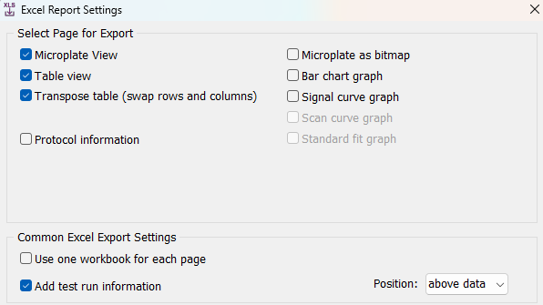

# quicR 

<!-- badges: start -->

[](https://cran.r-project.org/package=quicR)
[](https://github.com/gage1145/quicR/actions/workflows/R-CMD-check.yml)

<!-- badges: end -->

## Description
Real-time quaking induced conversion (RT-QuIC) has quickly become a valuable diagnostic tool for protein misfolding disorders such as Creutzfeldt-Jakob disease and Parkinson's disease. Given that the technology is relatively new, academic and industry standards for quality filtering data and high throughput analysis of results have yet to be fully established. The open source R library, quicR, was developed to provide a standradized approach to RT-QuIC data analysis. quicR provides functions, which can be easily integrated into existing R workflows, for data curation, analysis, and vizualization.


## Input Formatting
Much of the functionality is designed to be integrated with the Excel output files generated by the BMG analysis software, MARS. For best results, in the MARS software select the following options from the MARS export window:

{width=100%}

Having both the microplate view and the table view helps with
integrating plate layouts and the real-time data. For many of the functions, it is important to have a table labelled “Sample IDs” on the microplate view sheet of the Excel file.

## Key Metrics & Calculations
quicR has functions for calculating TtT, MPR, and MS (vizualized in [@fig-metrics]). There is no dedicated function for RAF since it can be expressed as the inverse of TtT, and can therefore be calculated separately as in the example in the Calculations section.

TtT is calculated by iterating through each sample until a value is greater than the user-supplied threshold. It then determines the intersection between the previous and current read times and the threshold. If no value was found larger than the threshold, the total reaction run-time is returned.

MPR is defined as the maximum fluorescence divided by the background fluorescence [@Rowden2023]. Thus, in order to calculate, the raw data must first be normalized against the background. This is done by the user choosing a cycle for background determination, and then dividing each read by that value. The MPR is taken as the max value of the normalized data.

MS is determined by approximating the maximum of the derivative of the raw data and is typically reported in units of $\Delta$RFU/h (i.e. the change in relative fluorescent units per hour). Slopes are calculated using differences between two data points within the range of a sliding window. While this slightly reduces the accuracy of the approximation, the improvement in computation time exceeded the loss in resolution.

![Example graph highlighting the calculated metrics described above. The red curve represents a raw data curve that has been normalized against background. The maxpoint ratio is calculated as the maximum fluorescent value achieved in the normalized raw data. Time-to-threshold is determined as the time required to cross a given threshold (in this example, the threshold is set at 0.2). The blue curve represents the approximate derivative of the raw data, and max slope is determined as the maximum of the derivative.](man/manuscript/images/metric_example.png){#fig-metrics}

## Examples

### Plate IDs for BMG Import

Use BMG_format.R script to format a .CSV file with a Sample IDs in a
plate view into a format importable into the BMG control software.

For example .CSV file, see ```tests/testthat/BMG_formatting/plate_layout.csv```

The file, “formatted.txt” in the same folder, is how the export should
look to be imported into the BMG software.

### Importing Raw Real-Time Data

Getting the real-time data from the MARS export is quite simple. Normalization can also be performed on the data.

``` R
# Import the raw data
df_ <- get_real("file.xlsx")

# Normalize the data based on the initial background reading.
df_norm <- normalize_RFU(df_)
```

### Importing Metadata

The MARS software exports microplate views of the samples with information that the user chose. Often, you will want to ensure that you included "Sample IDs" in that export. To import the metadata into your environment, run the following:

``` R
# Import the metadata as a named list of tables.
tabs <- organize_tables("file.xlsx", plate = 96)

# Convert the tables into dataframe columns
df_ <- convert_tables(tabs)
```

Additionally, MARS will also export the run metadata which is not sample dependent. This includes information such as the date, run ID, user ID, etc. To get this information run the following:

``` R
get_meta("file.xlsx")
```

If you need to know which wells were used in the plate, run:

``` R
wells <- get_wells("file.xlsx")
```

### Plate View

The function, ```plate_view``` exports a useful figure for quickly analyzing real-time data. It plots every sample in an 8x12 or 16x24 faceted grid for 96-well and 384-well plates, respectively.

Use ```.example_scripts/plate_view_export``` to export a plate view of the real-time data from an Excel file made in MARS.

### Calculations

quicR provides functions for calculating kinetic information from real-time data. These metrics include:
1. Maxpoint ratio: ```calculate_MPR```
2. Maximum slope: ```calculate_MS```
3. Time-to-threshold: ```calculate_TtT```

There is no function included for rate of amyloid formation (RAF) since that can be calculated as the inverse of time-to-threshold.

The script provided at ```.example_scripts/calculate_metrics.R``` will calculate these metrics.

An Excel file will also be created with the full data and summarized
data. A plot of the summarized data will also be created.

## Example Files
For example .xlsx files, see: 
```
inst/extdata/input_files/
```

## Installation
``` R
# For latest release
install.packages("quicR")

# For development version
devtools::install_github("https://github.com/gage1145/quicR")
```

## Author

Gage Rowden
